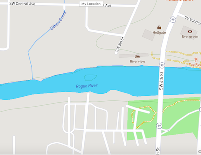

## Live Site:

https://where-fi.herokuapp.com/
The live version is hosted on Heroku. Right now it shows all of the free public wifi hotspots in NYC

## About Where-Fi

It uses NYC's public wifi hotspot api to map locations to the map.
https://data.cityofnewyork.us/resource/yjub-udmw.json

What started as a blogpost series quickly turned into a tool. Where-Fi show you where free wifi locations are in five boroughs of NYC. ALmost 1000 hotspots a mapped with this project. Check out "Getting Started with Mapbox GL JS" blog post articles. Feel free to check out the first article here, https://medium.com/swlh/getting-started-with-react-and-mapbox-gl-js-daa96477dd2c. I also have the following series' linked in this article.

## Purpose:

I love maps. I love looking at them, and I had heard MapBox is amazing, and allows a ton of customization and added features. It was a no brainer, I wanted to learn it. So I figured I would document my learning through blog posts, post it's coinciding project on Github for you to play around with and add to, so that you could learn MapBox too.

In it we use MapBox GL JS open source mapping software to perform some beginning tasks. Such as how to set this map up, how to set a users location on button click, how to add points to the map.

## Development:

MapBox Demo use React and MapBox GL JS API (which requires an account and token)

Feel free to download, run and make your own edits.

## Getting Started:

1. Go to mapbox, create and download your own token (it's free).
2. Clone repo to local
3. NPM install
4. Past your token into the <ReactMapGL> tag as a value in the key mapboxApiAccessToken.
5. NPM start to view in the browser.

## To-Do's:

1. Ability to find the hotspots nearest your current location.
2. MapRender is horribly slow, find a faster alternative/solution
